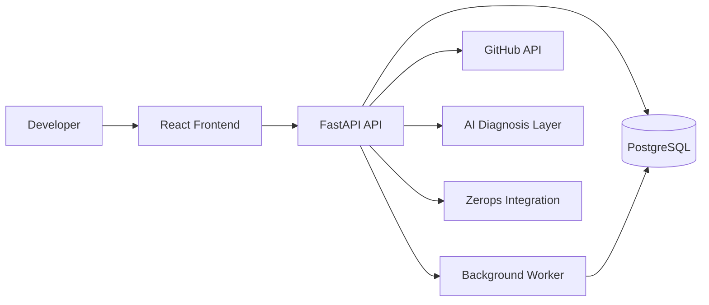

# InfraPilot AI

**Your AI Forward Deployment Engineer**

> From repository to verified production.

InfraPilot AI analyzes unfamiliar GitHub repositories, reconstructs application architecture, infers required infrastructure, generates an explainable Zerops deployment plan, diagnoses deployment failures, and produces verification evidence before declaring deployment production-ready.

[Live Demo](INSERT_LIVE_URL) · [Demo Video](INSERT_VIDEO_URL) · [GitHub](INSERT_GITHUB_URL) · [Architecture](#architecture)

> IMPORTANT: `zerops.yaml` must remain at the repository root for Zerops GitHub integration.

## What does InfraPilot do?

GitHub Repository
↓
Repository Intelligence
↓
Service Discovery
↓
Architecture Inference
↓
Zerops Infrastructure Plan
↓
zerops.yaml
↓
Deployment Diagnosis
↓
Verification Evidence

Most deployment tools stop at configuration generation. InfraPilot focuses on the full Forward Deployment Engineering loop: understand → plan → deploy → observe → diagnose → remediate → verify.

## The problem

Modern applications are often spread across multiple folders, frameworks, runtimes, databases, workers, environment variables, and container definitions.

A developer receiving an unfamiliar repository must answer questions such as:

- What services actually exist?
- Which services should be public?
- Which database is required?
- Which environment variables are mandatory?
- What should the deployment topology look like?
- Why did deployment fail?
- Is the application actually healthy after the build succeeds?

This translation from application code to production infrastructure is a Forward Deployment Engineering problem.

## The solution

InfraPilot performs:

- recursive repository analysis
- monorepo-aware service discovery
- framework/runtime detection
- Docker Compose architecture parsing
- environment contract extraction
- readiness scoring
- Zerops infrastructure planning
- service-specific zerops.yaml generation
- evidence-backed decisions
- deployment failure diagnosis
- deployment verification

## The demo in 60 seconds

1. Paste a GitHub repository.
2. InfraPilot scans the repository.
3. Multiple services are discovered.
4. Application architecture appears.
5. Deployment-readiness score is calculated.
6. Missing configuration or deployment risk is identified.
7. Zerops infrastructure plan is generated.
8. zerops.yaml is generated.
9. Deployment Doctor analyzes an actual failure.
10. InfraPilot explains the root cause.
11. Remediation is proposed.
12. Verification evidence is shown.

> InfraPilot does not treat build success as deployment success.

## Architecture



InfraPilot itself runs as separate services:

- frontend — React / Vite
- api — FastAPI
- worker — Python background analyzer
- db — PostgreSQL

These services are intended to be deployed as separate Zerops services with public access for frontend/API and private networking for worker/database.

<!-- SCREENSHOT: hero / repository analysis -->
<!-- SCREENSHOT: architecture graph -->
<!-- SCREENSHOT: zerops infrastructure plan -->
<!-- SCREENSHOT: deployment doctor -->
<!-- SCREENSHOT: deployment verification -->

## Why Zerops?

InfraPilot uses Zerops as the runtime environment for its multi-service architecture and as the target platform for generated deployment plans.

Zerops enables:

- multi-service deployment for frontend, API, worker, and database
- application runtime selection for Python and Node.js
- managed PostgreSQL as a production-grade data service
- private service networking for backend and worker components
- build and deploy configuration through zerops.yaml
- environment variable mapping for runtime secrets
- public application access for frontend and API services
- health and readiness verification through standard endpoints

## How AI is used

Component | Deterministic | AI-assisted
---|---|---
Repository parsing | yes | no
Framework detection | yes | optional
Service inference | yes | optional
Readiness score | yes | no
Environment extraction | yes | no
zerops.yaml generation | mostly deterministic | optional explanation
Deployment diagnosis | rules first | AI enrichment
Decision explanation | evidence-based | optional natural-language explanation

InfraPilot does not blindly send a repository to an LLM. It first extracts structured engineering signals from the repository. AI is then used where natural-language reasoning provides value, especially deployment diagnosis and explanation.

## Evidence-first reasoning

Decision:

- Recommend PostgreSQL

Evidence:

- `psycopg` dependency
- `DATABASE_URL` reference
- `postgres` service in `docker-compose.yml`

Confidence:

- 98%

Recommendation:

- Provision private PostgreSQL service on Zerops

Every high-confidence decision is traceable to repository evidence. InfraPilot never invents architecture without supporting signals.

## Deployment readiness

The readiness score is built from deterministic categories:

- Runtime — 15
- Framework — 10
- Dependencies — 10
- Start command / deployment config — 10
- Environment contract — 10
- Database configuration — 10
- Health/readiness — 15
- Tests — 10
- Deployment config — 10

The score is not generated arbitrarily by an LLM.

## Deployment Doctor

Deployment Doctor correlates:

- logs
- repository structure
- application architecture
- environment contract
- dependency evidence

It outputs:

- root cause
- evidence
- confidence
- remediation
- verification plan

Example:

ROOT CAUSE

- `DATABASE_URL` unresolved

EVIDENCE

- `psycopg.OperationalError`
- `DATABASE_URL` reference
- PostgreSQL dependency

FIX

- map the API to the managed database connection

VERIFY

- redeploy → `/ready` → `/health` → public endpoint

## Try it

Live application:

[INSERT LIVE ZEROPS URL]

Demo repository:

[INSERT DEMO REPOSITORY]

Demo video:

[INSERT VIDEO URL]

API docs:

[INSERT /docs URL]

## Local setup

### Backend

```bash
python -m venv .venv
# Windows:
.venv\Scripts\activate
# macOS/Linux:
# source .venv/bin/activate

pip install -r backend/requirements.txt

set DATABASE_URL=sqlite:///./infrapilot.db
set GITHUB_TOKEN=
set OPENAI_API_KEY=
set OPENAI_MODEL=

uvicorn backend.app.main:app --reload --port 8000
```

### Worker

```bash
# activate the same virtualenv
python -m backend.worker
```

### Frontend

```bash
cd frontend
npm install
npm run dev
```

Open http://localhost:5173.

## Deploying InfraPilot on Zerops

The repository includes `zerops.yaml` and `zerops-import.yaml` to help provision services.

Deployment steps:

1. Push the repository to GitHub.
2. Create a Zerops project.
3. Create separate services for frontend, api, worker, and database.
4. Configure environment variables for `DATABASE_URL`, `GITHUB_TOKEN`, and optional `OPENAI_API_KEY` / `OPENAI_MODEL`.
5. Deploy using `zerops.yaml`.
6. Expose frontend and API publicly.
7. Keep worker and database private.
8. Verify `/health` and any readiness endpoint.

## Security considerations

- repository contents are treated as untrusted
- arbitrary repository code is never executed during analysis
- secrets are never returned to the frontend
- API keys are never logged
- GitHub API requests use timeouts and public rate limits
- analysis is scoped by file count and manifest discovery
- simulated or placeholder data is labeled clearly

## AI-use disclosure

AI coding tools were used during development for scaffolding, debugging, testing assistance, design iteration, and documentation.

The project includes meaningful original engineering in:

- repository analysis
- monorepo service discovery
- framework detection
- readiness scoring
- environment mapping
- architecture inference
- deployment planning
- Zerops integration
- diagnosis logic
- testing
- UI workflow

The developer reviewed and understands the submitted code and architecture.

## Tech stack

- Frontend — React, Vite
- Backend — FastAPI, Python
- Data — PostgreSQL
- Worker — Python background worker
- Infrastructure — Zerops
- External integrations — GitHub API, optional LLM provider

## Project structure

- `backend/` — API, analyzer, worker, DB models
- `frontend/` — React dashboard and demo UI
- `zerops.yaml` — generated Zerops deployment config
- `zerops-import.yaml` — Zerops project import starter
- `README.md` — project overview and demo guide

## Roadmap

Potential improvements:

- live Zerops deployment orchestration
- automated remediation
- deployment history
- production metrics and health tracking
- scaling recommendations
- multi-cloud migration planning

## Final thought

AI can generate code. InfraPilot focuses on what comes next: understanding how that code becomes a reliable production system.

Built for the WeMakeDevs Zerops Challenge 2026.
